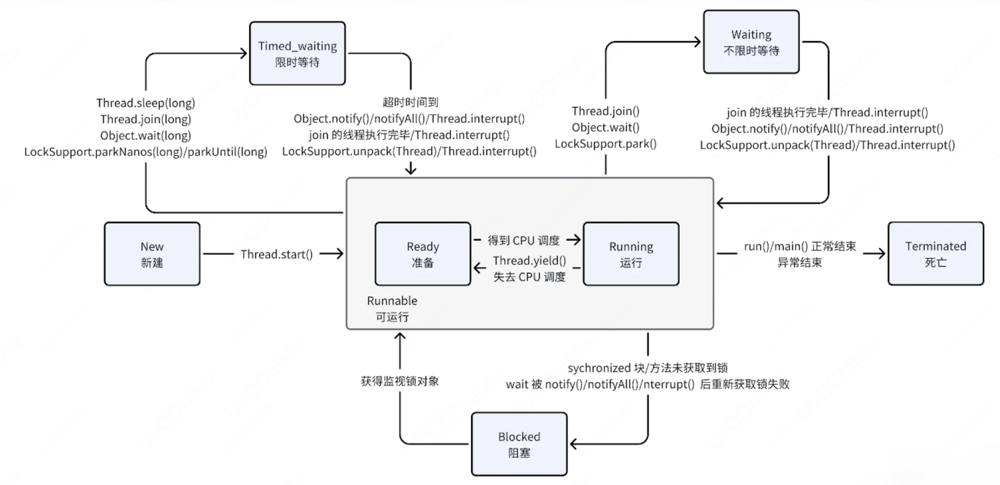

# 多线程

## 一、线程的生命周期(JDK1.5^)



1. **New（新建）**: 线程刚被创建，但是并未启动。还没调用 `start()` 方法。

2. **Runnable（可运行）**: 线程被调用了 `start()` 等待运行的状态。

3. **Blocked（锁阻塞）**: 一个等待一个监视器锁的线程处于这一状态，只有获得锁对象的线程才能有执行机会。

4. **Waiting（无限等待）**: 一个正在无限期等待另一个线程唤醒的线程处于这一状态。
    1. 通过 Thread 类的 join 进入 Waiting 状态，只有调用 join 方法的线程对象结束才能让当前线程恢复
    2. 通过 Object 类的 wait 进入 Waiting 状态的要有 Object 的 notify/notifyAll 唤醒
    3. 通过 Condition 的 await 进入 Waiting 状态的要有 Condition 的 signal 方法唤醒
    4. 通过 LockSupport 类的 park 方法进入 Waiting 状态的要有 LockSupport 类的 unpark 方法唤醒

5. **Timed_waiting（计时等待）** 一个正在限时等待另一个线程唤醒的线程处于这一状态。
    ::: raw
    当前线程执行过程中遇到 Thread 类的 sleep 或 join，Object 类的 wait，LockSupport 类的 park 方法，并且在调用这些方法时设置了时间，那么当前线程会进入 Timed_waiting，直到时间到或被中断。
    :::

6. **Teminated（被终止）**: 表明此线程已经结束生命周期，终止运行。
  
## 二、线程池

```java
List<LeanIssueStatis> leanIssueStatises = leanIssueDao.getStatisByIssueIds(issueIds);

List<Integer> issueIdList = leanIssueStatises.stream().map(LeanIssueStatis::getId).collect(Collectors.toList());
Map<Integer, List<CustomDto>> customDtoMap =
        leanIssueService.mapCustomDto(issueIdList, leanIssueStatises.get(0).getType(), false, null);
Map<Integer, String> catalogPathMap = catalogInnerService.getFullPathMap(boardId);

Map<String, String> scenarioOptionMap = leanCardCustomerFieldService.getOptionFullPathMap(boardId,
        WorkOrderAllFieldEnum.SCENARIO.getId());

Map<Integer, Integer> issueIdCatalogIdMap = catalogTaskOutService.getCatalogIdsByIssueIds(issueIdList);
Map<Integer, List<LeanTag>> issueTagsMap = leanIssueTagService.mapTags(issueIdList);

```