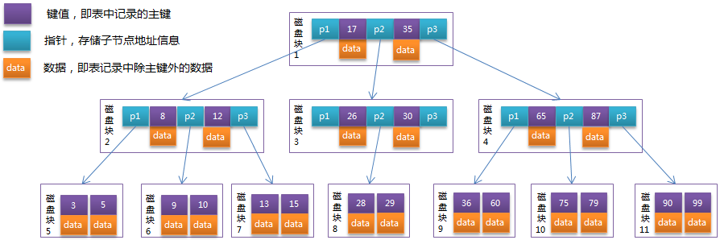

# Mysql索引

## 索引选择

(1) 哈希表  
哈希虽然能够提供O(1)的单数据行的查询性能，但是对于范围查询和排序却无法很好支持，需全表扫描。

(2) 红黑树  
红黑树(Red Black Tree)是一种自平衡二叉查找树，在进行插入和删除操作时通过特定操作保持二叉查找树的平衡，从而获得较高的查找性能。

一般来说，索引本身也很大，往往不可能全部存储在内存中，因此索引往往以索引文件的形式存储的磁盘上。这样的话，索引查找过程中就要产生磁盘`I/O`消耗，相对于内存存取，`I/O`存取的消耗远远高于内存，所以评价一个数据结构作为索引的优劣最重要的指标就是查找过程中磁盘`I/O`次数。换句话说，**索引的结构组织要尽量减少查找过程中磁盘`I/O`的次数。**

在这里，磁盘`I/O`的次数取决于树的高度，所以，在数据量较大时，红黑树会因树的高度较大而造成磁盘`I/O`较多，从而影响查询效率。

(3) B-Tree  
B树中的B代表平衡(Balance)，而不是二叉(Binary)，B树是从平衡二叉树演化而来的。

为了降低树的高度(也就是减少磁盘`I/O`次数)，把原来瘦高的树结构变得矮胖，B树会在每个节点存储多个元素(红黑树每个节点只会存储一个元素)，并且节点中的元素从左到右递增排列。如下图所示：

B-Tree在查询的时候比较次数其实不比二叉查找树少，但在内存中的大小比较、二分查找的耗时相比磁盘`I/O`耗时几乎可以忽略。 **`B-Tree`大大降低了树的高度**，所以也就极大地提升了查找性能。

(4) B+Tree  
`B+Tree`是在`B-Tree`基础上进一步优化，使其更适合实现存储索引结构。InnoDB存储引擎就是用B+Tree实现其索引结构。

`B-Tree`结构图中可以看到每个节点中不仅包含数据的`key`值，还有`data`值。而每一个节点的存储空间是有限的，如果`data`值较大时将会导致每个节点能存储的`key`的数量很小，这样会导致`B-Tree`的高度变大，增加了查询时的磁盘`I/O`次数，进而影响查询性能。在`B+Tree`中，所有`data`值都是按照键值大小顺序存放在同一层的叶子节点上，而非 **叶子节点上只存储`key`值信息**，这样可以增大每个非叶子节点存储的key值数量，降低`B+Tree`的高度，提高效率。

随机`I/O`对于MySQL的查询性能影响会非常大，而顺序读取磁盘中的数据会很快，由此我们也应该尽量减少随机`I/O`的次数，这样才能提高性能。在`B-Tree`中由于所有的节点都可能包含目标数据，我们总是要从根节点向下遍历子树查找满足条件的数据行，这会带来大量的随机`I/O`，而`B+Tree` 所有的数据行都存储在叶子节点中，而这些叶子节点通过**双向链表** 依次按顺序连接，当我们在`B+Tree`遍历数据(比如说范围查询)时可以直接在多个叶子节点之间进行跳转，保证**顺序、倒序**遍历的性能。

在线数据结构可视化演示工具  
**https://www.cs.usfca.edu/~galles/visualization/Algorithms.html**

## 主键索引
索引属于存储引擎级别的概念。不同存储引擎对索引的实现方式是不同的

### MyISAM索引实现

`MyISAM`引擎使用`B+Tree`作为索引结构时叶子节点的`data`域存放的是数据记录的地址。如下图所示  

由上图可以看出：MyISAM索引文件和数据文件是分离的，索引文件仅保存数据记录的地址，因此MyISAM的索引方式也叫做`非聚集`的，之所以这么称呼是为了与InnoDB的`聚集索引`区分。  

### InnoDB索引实现 
InnoDB的`主键索引`也使用`B+Tree`作为索引结构时的实现方式却与MyISAM截然不同。**InnoDB的数据文件本身就是索引文件**。在InnoDB中，表数据文件本身就是按`B+Tree`组织的一个索引结构，这棵树的叶子节点`data`域保存了完整的数据记录，这个索引的`key`是数据表的主键，因此InnoDB表数据文件本身就是主索引。
 

`InnoDB`存储引擎中的主键索引(`primary key`)又叫做聚集索引(`clustered index`)。因为`InnoDB`的数据文件本身要按主键聚集，所以`InnoDB`要求表必须有主键（MyISAM可以没有），如果没有显式指定，则MySQL系统会自动选择一个可以唯一标识数据记录的列作为主键，如果不存在这种列，则MySQL自动为InnoDB表生成一个隐含字段作为主键，这个字段长度为6个字节，类型为长整形。(详情见官方文档：https://dev.mysql.com/doc/refman/5.7/en/innodb-index-types.html)

在InnoDB中，用非单调递增的字段作为主键不是个好主意，因为InnoDB数据文件本身是一棵`B+Tree`，非单增的主键会造成在插入新记录时数据文件为了维持`B+Tree`的特性而频繁的分裂调整，十分低效，因而使用递增字段作为主键则是一个很好的选择。

## 非主键索引

### MyISAM索引实现

MyISAM中，主键索引和非主键索引（`Secondary key`，也有人叫做`辅助索引`）在结构上没有任何区别，只是主键索引要求key是唯一的，而辅助索引的key可以重复。

### InnoDB索引实现

InnoDB的非主键索引`data`域存储相应记录`主键的值`。换句话说，InnoDB的所有非主键索引都引用主键的值作为data域。如下图所示：

由上图可知：使用非主键索引搜索时需要检索两遍索引，首先检索非主键索引获得主键(`primary key`)，然后用主键到`主键索引树`中检索获得完整记录。

那么为什么非主键索引结构叶子节点存储的是主键值，而不像主键索引那样直接存储完整的一行数据，这样就能避免回表二次检索？显然，这样做一方面节省了大量的存储空间，另一方面多份冗余数据，更新数据的效率肯定低下，另外保证数据的一致性是个麻烦事。

到了这里，也很容易明白为什么不建议使用过长的字段作为主键，因为所有的非主键索引都引用主键值，过长的主键值会让非主键索引变得过大。

## 联合索引

比如INDEX idx_book_id_hero_name (book_id, hero_name) USING BTREE，即对book_id, hero_name两列建立了一个联合索引。  

联合索引是多列按照次序一列一列比较大小，拿idx_book_id_hero_name这个联合索引来说，先比较book_id，book_id小的排在左边，book_id大的排在右边，book_id相同时再比较hero_name。如下图所示：

联合索引中的多列是按照列的次序排列的，如果查询的时候不能满足列的次序，比如说where条件中缺少`col1 = ?`，直接就是`col2 = ?` and `col3 = ?`，那么就走不了联合索引，从上面联合索引的结构图应该能明显看出，只有col2列无法通过索引树检索符合条件的数据。  

